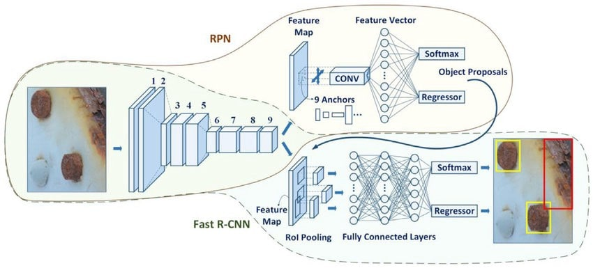

# Traffic Light Classifier using Faster R-CNN   

Using TensorFlow Object Detection API, I built this traffic light classifier which is a crucial part of Udacity's Self Driving Car Engineer Nanodegree Capstone - Programming a Real Self-Driving Car.  

## System Integration & Implementation  
**Project Overview**  

The car would be operated on a test track and required to follow waypoints in a large circle. If the light is green, then the car is required to continue driving around the circle. If the light is red, then the car is required to stop and wait for the light to turn green. This is a part of the Perception process, one among the three major steps in the system integration project.  

For traffic light detection and classification we decided to build a SSD (Single Shot MultiBox Detector) network as the purpose of the SSD is to detect the location and classify the detected object in one pass through the network.  

Due to the limited amount of data available to train the network the decision was made to take a pre-trained network and transfer learn the network on the available simulated and real datasets provided by Udacity.  

For this we chose Faster-RCNN. The chosen network was pre-trained with the COCO dataset.  

Transfer learning was achieved using the Object Detection API provided by Tensorflow. For simulated data the network was trained on the provided data by Udacity, however real-world data provided by Udacity was supplemented with a dataset of labelled traffic light images provided by Bosch. This dataset can be found [here](https://github.com/bosch-ros-pkg/bstld).  

## Dataset  
For simulated data the network was trained on the provided data by Udacity, however real data provided by Udacity was supplemented with a dataset of labelled traffic lights provided by Bosch. This dataset can be found [here](https://github.com/bosch-ros-pkg/bstld).  

## Data Collection Strategy  
Using different Classification models for the Simulator and Site:  
Due to differences in the appearance of the site and simulator traffic lights, using the same traffic light classification model for both might not be appropriate. For this purpose is_site boolean from traffic_light_config is used to load a different classification model depending on the context.  

# Building a Classifier:  
Getting started with the installation. Find the instructions on [Tensorflow Object Detection API repository](https://github.com/tensorflow/models/tree/master/research/object_detection) and go the path: `tensorflow/models/object_detection/g3doc/installation.md`.  
- Clone or download the repo present under tensorflow/models  
- Go to github.com/google/protobuf/releases/protoc-3.4.0-win32.zip (choose an appropriate one based on your OS)  
- Extract the two downloaded files (mentioned above)  
- Run the jupyter notebook 'object_detection_tutorial.ipynb'. This downloads a pretrained model for you. The pretrained model here is COCO (common objects in context)  
- The actual detection process takes place in the 'for' loop (in the last cell), which we need to modify based on our needs accordingly  
- Loading in your custom images: In the jupyter notebook, make the necessary imports to load your images from a directory, modify the notebook to meet your needs and run it  

## How to build a custom (traffic light) object detection model using Tensorflow Object Detection API:  

Add your objects of interest to the pre-trained model or use that models weights to give us a head start on training these new objects. The Tensorflow Object Detection API is basically a tradeoff between accuracy and speed.  

Steps:  
1. Collect around 500 (or more if you choose to) custom traffic light images ready  
2. Hand label the custom images using labelImg  
3. Split them into train-test sets  
4. Generate a TFRecord for the train-test split  
5. Setup a config file  
6. Train the actual model  
7. Export the graph  
8. Bring in the frozen inference graph and use that to classify traffic lights  

### Step 1: Collecting custom traffic light images  
**Simulator**: Run the simulator with the camera on and follow the instructions to collect the traffic light images from the simulator.  

**Site**: Download the carla site's traffic light images from the ROS bag provided by Udacity  

### Step 2: Hand labelling the custom traffic light images:  
Hand label the traffic light dataset images by using ['labelImg'](https://github.com/tzutalin/labelImg).  
Steps:  
- Clone the labelimg repository  
- Follow along the installation steps meeting your python version requirements  
- Run 'python labelimg.py'  
- Open dir and open your traffic light dataset images  
- For every image, cretae a RectBox around the traffic lights you want to detect and add the labels accordingly (RED, GREEN, YELLOW in our case)  
- Save them in the directory of your choice. Follow these steps to custom label all the images  

### Step 3: Train-test split:  
Do a 90-10 split: Add the images and their matching XML annotation files to train (90%) and test (10%) folders.  

### Step 4: Generating TFRecords for the train-test split:  
We need some helper code from Dat Tran's [raccoon_dataset](https://github.com/datitran/raccoon_dataset) repository from GitHub. We just need 2 scripts from this repo: 'xml_to_csv.py' and 'generate_tfrecord.py'.  

**xml_to_csv.py**:  
- Make the necessary modifications in the main function of this file. This will iterate through the train and test to create those separate CSVs and then from these CSVs we create the TFRecord.  
- For more info, please go through Dat Tran's medium post: https://towardsdatascience.com/how-to-train-your-own-object-detector-with-tensorflows-object-detector-api-bec72ecfe1d9  
- Run the 'python3 xml_to_csv.py' command. Now, you have the CSV files ready: 'train_labels.csv' and 'test_labels.csv'  

**generate_tfrecord.py**:  
- Next, we need to grab the TFRecord: Go to dattran/raccoon_dataset/generate_tfrecord.py  
- Make the necessary modifications based on your requirements (add three 'row_label' values each for RED, GREEN and YELLOW in the if-elif-else statement)  
- Make sure you have installed Object Detection (installation.md on github). Run the two commands each for train and test present in the 'Usage' section of generate_tfrecord.py. Now we have the train and test record files ready.  

The reason we need the TFRecord files is to convert from anything that will generate data (say, Pascal VOOC format) to TFRecord so we could use them with the Object Detection API.  

### Step 5: Setup a configuration file  
To train our model, we need to setup a config file (along with TFRecord, pre-trained model). Please find all the relevant files, installation information, pre-trained models and more on [Tensorflow Object Detection API](https://github.com/tensorflow/models/tree/master/research/object_detection).  

Steps:  
- Go to tensorflow/models/object_detection/samples/configs on GitHub  
- Download the model of your choice (Faster-RCNN, in our case) from the TF model detection zoo  
- Run the two commands, each to donwload the config file and the F-RCNN model (also extract the downloaded model)  
- Modify the config file to meet your requirements including, but not limited to, PATH_TO_BE_CONFIGURED, num_classes, batch_size, path to fine_tune_checkpoint  
- Add the label map file with item and id values each for RED, YELLOW, and GREEN  

### Step 6: Train the actual model  
- Run your model using the python command while including the path to save the model, pipeline for the config file  
- At this point, you should see the model summary with the steps and their corresponding loss values  
- You could load up Tensorboard, if you want to visualize the values incuding loss, accuracy, steps and training time  
- Now, you have the trained model ready. Next, load the model via checkpoint  

**Faster RCNN Model Architecture**:  
Faster R-CNN was originally published in [NIPS 2015](https://arxiv.org/abs/1506.01497). The architecture of Faster R-CNN is complex because it has several moving parts.  

Here's a high level overview of the model. It all starts with an image, from which we want to obtain:  
- a list of bounding boxes  
- a label assigned to each bounding box  
- a probability for each label and bounding box  

  

This [blog](https://tryolabs.com/blog/2018/01/18/faster-r-cnn-down-the-rabbit-hole-of-modern-object-detection/) has a pretty good explanation of how Object Detection works on Faster RCNN.  
This [medium post](https://medium.com/@smallfishbigsea/faster-r-cnn-explained-864d4fb7e3f8) is quite helpful to get a quick overview of the Faster RCNN networks.  

_NOTE_:  
After experimenting with different models including **SSD Inception V2**, **Faster RCNN** and **Nvidia's Convolutional Neural Network**, we eventually decided to go with Faster RCNN after finding its performance to be compelling for our traffic light dataset. At the end of the day, choosing an appropriate model is a trade-off between accuracy and speed to meet your requirements.  

### Step 7: Export the graph  
- Export the inference graph and save it  
- Go to protobuf compilation present under tesorfow/models/object_detection and export the path. So, this loads up TF, makes the graph and saves it  
- Use this to do the object detection using the notebook object_detection_tutorial.ipynb that came in with the API  

### Step 8: Bring in the frozen_inference_graph to classify the traffic lights  
- Modify the 'export_inference_graph.py' to meet your requirements  
- Run the installation command to export the inference graph (tensorflow/models/object_detection/installation.md). Now, you have the 'frozen_inference_graph.pb' and checkpoint files ready  
- Open the object_detection_tutorial.ipynb notebook. Make the necessary modifications in the notebook including, but not limited to, model name, NUM_CLASSES, TEST_IMAGE_PATHS. Run the notebook to see your traffic lights with bounding boxes and their prediction accuracies  

